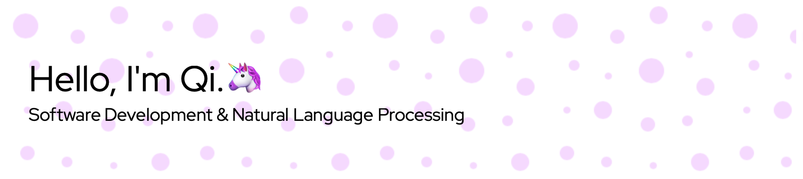

  

Homepage: https://qi-yu.github.io

### My Tech Stacks 
<code style="color: grey">(* = what I'm currently learning)</code>

|                      |                       |
|--------------------------|---------------------------------------------------------------------|
| Programming Languages             |   <code></code> <code></code> <code></code> <code></code>* <code></code> <code></code> <code></code>                                                        |
| Machine Learning Frameworks  | <code></code> <code></code> <code></code> <code></code>                                                                                                                                                                                                 |
| Frontend             | <code></code> <code></code> <code></code> <code></code>* <code></code> <code></code> <code></code> <code></code> <code></code>    |
| Backend             | <code></code> <code></code> <code></code>* <code></code> <code></code>    |
| Version Control, Project Management, IDE             | <code></code> <code></code>* <code></code> <code></code> <code></code> <code></code>    |

<!--
**qi-yu/qi-yu** is a ✨ _special_ ✨ repository because its `README.md` (this file) appears on your GitHub profile.

Here are some ideas to get you started:

- 🔭 I’m currently working on ...
- 🌱 I’m currently learning ...
- 👯 I’m looking to collaborate on ...
- 🤔 I’m looking for help with ...
- 💬 Ask me about ...
- 📫 How to reach me: ...
- 😄 Pronouns: ...
- ⚡ Fun fact: ...
-->
